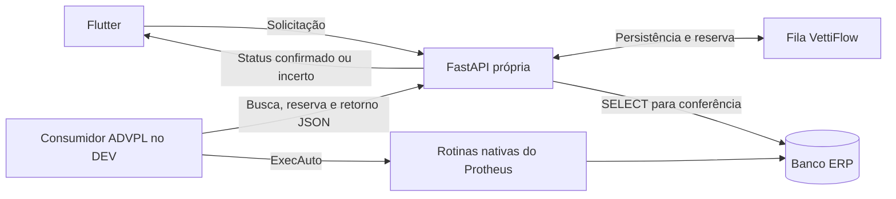

# VettiFlow Flutter App

Aplicativo Flutter para acompanhar os setores da Vetti e consultar o Protheus DEV.

**Autenticação da API em 29/09/2026:** consultas e operações agora exigem sessão
Bearer obtida por `POST /api/v1/auth/protheus/login`, além da chave interna
quando configurada. [Uso no Swagger e limites da sessão](api/README.md#sessão-jwt-obrigatória-29092026).
O login Flutter valida usuário e senha no Protheus pela API e envia o Bearer nas
consultas. O JWT fica somente em memória; expiração, logout ou HTTP 401 retornam
à tela de login. `leonardo.morais` tem o perfil de administrador da interface,
sem conceder privilégios adicionais no ERP. A sessão REST não mantém uma thread permanente
no WebMonitor. O painel já consulta OPs abertas do ERP. A sessão renova pelo Protheus quando há refresh token, até oito horas; o teste real da renovação no DEV está pendente. A fila do Vitor foi incorporada, mas a execução ADVPL permanece bloqueada até homologação.

**Direção acordada em 28/09/2026: escrita por fila do VettiFlow, consumida por ADVPL que executa as rotinas nativas do Protheus.** Este plano segue a mesma linha do documento **“Plano de escrita no Protheus via ADVPL”**, compartilhado pela T.I. Vetti nessa data, e incorpora a orientação do gestor sobre leitura de JSON e execução dentro do ERP.

**Estado atual:** existem consultas, telas, rascunhos locais e um protótipo anterior de escrita SQL DEV. A fila persistente e o consumidor ADVPL inicial foram incorporados do commit 1e12242 do Vitor. A integração de autenticação do consumidor, a compilação e a homologação no ERP permanecem pendentes. Nenhuma compilação no RPO ou escrita no ERP foi realizada nesta revisão. Este README é o ponto de partida para continuar essa frente; os documentos anteriores preservam o contexto das alternativas estudadas.

O [protótipo SQL DEV](docs/desenvolvimento/sql-producao-dev.md) permanece no repositório, desativado por padrão. Ele não é a solução escolhida para a integração operacional. Não habilitar `VF_SQL_WRITE_ENABLED`/`VF_SQL_EXCLUSIVE_DEV` para executar este plano, nem aplicar sua migração como pré-requisito da fila ADVPL. Esta atualização é documental: não remove esse código, não modifica permissões do banco e não altera o `.env` de nenhuma instalação.

## Plano de integração Protheus: alinhamento e continuidade

### Decisões já tomadas

- O fluxo operacional da Tatiane já foi validado, conforme confirmação do Leonardo. Não reiniciar esse levantamento; os pontos pendentes abaixo são de implementação e identificação técnica.
- O app envia pedidos tipados à API própria. Na arquitetura alvo, a API grava apenas dados próprios do VettiFlow e consulta o ERP; as movimentações ERP são executadas dentro do Protheus.
- Usar MATA650 para abertura, MATA261 para transferência e MATA250 para apontamento, via ExecAuto conforme contrato e versão da rotina. Ajustes de empenhos usam MATA380/MATA381 conforme o caso.
- Começar por uma opção de menu no DEV que processe um pedido explícito. Schedule e produção vêm após a validação. Eliminar REST de entrada não comprova ausência de consumo de licença.
- Etapas, prioridade e acompanhamento do VettiFlow continuam separados da criação e dos movimentos oficiais da OP.

### O que existe e o que ainda falta

| Parte | Situação verificável | Continuidade |
|---|---|---|
| Consultas ERP | [API de leitura](api/app/mssql.py), movimentos, saldos e prévia de apontamento existentes | Reutilizar SELECTs para validação e conferência; prévia não é prova de gravação |
| Rascunhos e sincronização Flutter | [PendingMutationStore](lib/data/repositories/pending_mutation_store.dart), [MutationSyncService](lib/data/repositories/mutation_sync_service.dart) e [ProtheusSyncClient](lib/data/repositories/protheus_sync_client.dart) existentes; cliente bloqueia escrita | Adaptar estados e transporte; persistência local não substitui fila compartilhada |
| Adapter anterior | [warehouse_writes.py](api/app/warehouse_writes.py) espera `/capabilities` e `/orders` de um serviço proposto | Substituir essa dependência pelo consumidor da fila; esses endpoints não foram encontrados prontos no servidor |
| Protótipo SQL | [sql_production_api.py](api/app/sql_production_api.py), módulos associados e tela própria existentes | Preservar como contexto; não ampliar nem habilitar para cumprir o plano ADVPL |
| Fila de execução e consumidor ADVPL | Ainda não implementados | Construir API, persistência, reserva, retorno e rotina de menu |
| Fontes customizados Vetti | Cópia local inspecionada, externa a este repositório | Centralizar/versionar em local acordado; confrontar revisão dos fontes com o RPO DEV |
| Compilação e operação no DEV | Leonardo tem acesso à VM; acesso à compilação ainda não confirmado | Confirmar ferramenta, ambiente e permissão antes de compilar; não há teste integrado concluído |

### Fluxo real e correções técnicas incorporadas

O documento da T.I. usa a OP **01643101001** (número 016431), produto **575-0863**, quantidade **10**, como referência do fluxo manual de 28/09/2026. A consulta anterior confirmou o estado final: OP no local 05, quantidade produzida 10, encerramento, uma entrada PR0 do acabado no 10 e nove consumos RE1 do 05, incluindo componentes de mão de obra. Na SD4, o saldo `D4_QUANT` ficou zerado; os registros e `D4_QTDEORI` permaneceram. “Zerar empenhos” não significa excluir suas linhas.

O relato novo informa empenhos inicialmente em **01, 04 e 05**, depois direcionados ao **05**, com transferência física apenas do componente faltante **106-008**, 10 unidades de **01 para 05**, motivo **055**. Esse relato é a referência operacional fornecida pela equipe. Uma consulta ao estado final não comprova sozinha a sequência de mudanças nem qual rotina as executou. O movimento de transferência consultado anteriormente tinha `D3_OP`/`D3_OPVT` vazios; seu vínculo com a OP não deve ser inferido apenas pela data ou pelo usuário.

| Etapa | Efeito esperado | Ponto de implementação |
|---|---|---|
| Consulta | SB1: produto/componentes; SG1: estrutura; SB2: saldos e reservas | Reutilizar leitura existente; estrutura e saldo podem mudar entre prévia e execução |
| Abertura | SC2 com filial 04, local 05, produto, quantidade e datas; `C2_VOP` e `C2_VGRU`; SD4 e reservas na SB2; intermediárias conforme configuração | MATA650; abertura não deve baixar estoque físico. Não fixar como comprovado que todo empenho já nasce no 05 |
| Direcionamento dos empenhos e abastecimento | Empenhos passam ao local de consumo; somente materiais selecionados/faltantes são transferidos, gerando SD3/SB2 | São efeitos distintos. Identificar a rotina que altera `D4_LOCAL` e usar MATA261 para o movimento físico, preservando motivo e seleção de itens |
| Apontamento | MATA250, TM 001 conforme exemplo local; RE1 consome componentes, reduz saldos/empenhos; PR0 recebe o acabado; SC2 atualiza produção e encerramento quando aplicável | Armazém de entrada editável: sugerir `C2_LOCAL`, permitindo o destino válido escolhido. O 10 do exemplo não é regra universal; validar apontamentos parciais separadamente |
| Ajuste de empenhos e movimentos posteriores | Alteração suportada de empenhos; eventual transferência do acabado | MATA380/MATA381 conforme necessidade. Transferir produto já produzido não deve apontar sua produção novamente |

**Identificação dos fontes:** `RPCPE002.prw` é o botão **“Envio p/ 3º”**, usa `C2_LOC3`, chama MATA261 e marca `C2_3Envio`. Não assumir que seja a transferência de abastecimento da Tatiane. `RESTA008.prw` é **“Transferência de Empenhos”**, permite remover linhas da lista e chama MATA261. Remover uma linha dessa lista não equivale a excluir o empenho da OP; o fonte tampouco demonstra uma atualização explícita de todos os `D4_LOCAL` ou cálculo automático do que falta no destino. A associação exata entre botão, rotina e mudança de armazém ainda precisa ser identificada.

`MTA650I.prw` preenche `C2_VOP`/`C2_VGRU`; `A650LEMP.prw` retorna `C2_LOCAL` em um evento relacionado à tela de empenhos. Conferir ambos na execução automática. ExecAuto não garante todos os pontos de entrada da interface: a TOTVS documenta, por exemplo, [MTA650GEM somente pelo menu](https://tdn.totvs.com/pages/viewpage.action?pageId=271661353). Não corrigir eventual diferença com UPDATE direto na SD4.

### Arquitetura alvo



O transporte escolhido para o primeiro incremento é **HTTP de saída do ADVPL para a API do VettiFlow**. Assim, a reserva e as atualizações da fila ficam centralizadas na API; o consumidor não precisa escrever diretamente no banco da fila nem expor REST no AppServer. O exemplo `RWEBE001.PRW` do CNPJá demonstra consumo de JSON externo e preenchimento por funções ADVPL, mas não implementa a fila nem a abertura de OP.

SQL parametrizado pode manter a fila em banco/schema próprio, fora das tabelas e do dicionário de negócio do Protheus. O usuário da API precisa de leitura ERP e das permissões necessárias para **inserir, consultar e atualizar a própria fila**. Somente INSERT/SELECT não permite reservar pedidos ou salvar resultados. Escolher e documentar o armazenamento persistente antes da implementação; o SQLite do adapter anterior não constitui essa fila pronta.

RecLock/MsUnlock serve para gravações delimitadas de campos/marcações. Não substitui a regra de movimentação, custos, reservas e encerramento. Stored procedure/TCSQLExec escrevendo no ERP também não substitui ExecAuto.

### Fase 0 — Ambiente para execução real

- Confirmar quem compila no **RPO do DEV** — repositório dos programas compilados — por TDS ou VS Code com extensão TOTVS. Ter senha SQL ou acesso à VM não comprova essa permissão.
- Centralizar os fontes customizados e identificar a versão instalada. A cópia inspecionada está em `C:/Users/Leonardo Morais/Desktop/vetti/VettiFlow/protheus_advpl/vettip12`; esse caminho local não estará disponível em outro clone. Não temos os fontes padrão completos de MATA650/MATA250/MATA261.
- Confirmar banco efetivo **HMLp12**, grupo **01**, filial **04**, tabelas com sufixo **010**, servidor e ambiente AppServer. Grupo 01 e sufixo 010 não são intercambiáveis.
- Esclarecer a diferença registrada entre RootPath REST `E:\Protheus12\protheus_data` e DEV `E:\Protheus12DEV\protheus_data`. Não alterar os caminhos por suposição. Para o consumidor, verificar seu próprio ambiente efetivo; não depender apenas do nome do serviço.
- Definir usuário autorizado para o teste manual. Usuário técnico e consumo de licença por Schedule serão verificados antes do agendamento.

Esses itens condicionam compilação e execução real. Podemos preparar contrato, código e testes locais enquanto o acesso à VM estiver indisponível; isso não equivale a homologação no Protheus.

### Fase 1 — Contrato e fila persistente

Os nomes abaixo são **propostos**, ainda não são endpoints disponíveis. Primeiro incremento: abertura de OP; demais operações entram individualmente.

| Campo | Regra |
|---|---|
| `id`, `versao_contrato` | UUID persistido antes do primeiro envio; reutilizado em toda consulta/repetição do mesmo pedido |
| `operacao`, `empresa`, `filial`, ambiente | Operação permitida, grupo 01/filial 04 e destino validado; nunca aceitar SQL livre |
| `payload`, `payload_hash` | Dados tipados e imutáveis após aceitação; mesmo ID com conteúdo diferente retorna conflito |
| `solicitante`, `executor` | Solicitante autenticado/autorizado e identidade de quem executou no Protheus; não confiar somente num nome recebido no JSON |
| `status`, `mensagem`, `log_execauto` | Estado de execução/conferência e retorno sem senhas/tokens |
| `protheus_refs` | Referências completas, incluindo filial e chaves necessárias; aceitar múltiplos registros/documentos/OPs intermediárias |
| `criado_em`, `reservado_em`, `atualizado_em`, reserva | Datas e identificação exclusiva da reserva para impedir execução ou retorno de outro consumidor |

Contrato mínimo: `POST /solicitacoes`, `GET /solicitacoes/{id}` e endpoints autenticados do consumidor para reservar um pedido e registrar seu resultado. Padronizar o prefixo com a API atual na implementação. A credencial do consumidor e a autorização de escrita devem ser separadas do acesso de consulta do app.

Estados propostos: `pendente -> processando -> aguardando_conferencia -> aplicada`; rejeição comprovadamente sem efeito fica `rejeitada`; queda, divergência ou efeito desconhecido fica `incerta`. Resultado de sucesso do ExecAuto ainda passa pela conferência antes de aparecer como aplicado no app.

### Fase 2 — Consumidor ADVPL e primeira abertura

1. Criar uma opção de menu para buscar/visualizar um pedido JSON, inicialmente sem movimentar o ERP. Validar contrato, ambiente, produto, quantidade, datas e autorização.
2. Reservar um único pedido atomicamente na API: somente `pendente` pode mudar para `processando`; zero registros alterados impede a execução. A transação da reserva deve terminar antes da chamada ao ERP. Serializar operações conflitantes sobre a mesma OP e revalidar o estado no momento da execução.
3. Implementar a abertura com MATA650 e captura de `lMsErroAuto`/`GetAutoGRLog`. Separar o executor da interface: nada de MsgYesNo/MostraErro dentro da função que depois poderá rodar em job. Conferir campos Vetti, empenhos, MO e intermediárias na revisão instalada.
4. Registrar vínculo durável entre solicitação e efeitos ERP. Campos como `C2_XVFID`/`D3_XVFID` são uma proposta, **não existem por este README**; se adotados, criar pelo dicionário apropriado e verificar preenchimento no mesmo limite transacional da operação. Marcar somente depois do commit deixa uma janela para duplicação. Um pedido pode gerar várias linhas; o ID da solicitação não deve ser uma chave única de cada linha SD3.
5. Devolver resultado e referências. Falha no retorno não autoriza executar de novo. Reserva vencida vira `incerta`, sem voltar automaticamente a `pendente`; eventual resultado tardio precisa ser associado à reserva correta e conferido. Só classificar `rejeitada` se ausência de gravação parcial/rollback estiver confirmada.

Continuar depois com transferência e apontamento. O ajuste manual de empenhos fica por último como funcionalidade própria, mas qualquer direcionamento de empenho exigido pelo fluxo precisa estar resolvido **antes** do apontamento. Não adiar uma dependência operacional só porque o CRUD de empenhos está numa fase posterior.

### Fase 3 — Conferência dos efeitos

Usar SELECTs da API para conferir SC2, SD4, SD3 e os efeitos esperados na SB2. Capturar a situação relevante antes/depois do teste e correlacionar pelas referências da solicitação. Saldo agregado da SB2 pode mudar por outras operações; não atribuir toda diferença do saldo ao pedido sem considerar concorrência.

A prévia de apontamento existente auxilia a comparação de PR0/RE1, mas precisa ser atualizada no momento da execução e tratar quantidade parcial, saldo remanescente, MO e regras do Protheus. “RE1 = D4_QTDEORI” descreve o exemplo total apresentado, não todos os apontamentos possíveis. Guardar evidência de sucesso, rejeição ou divergência. Erro de consulta após gravação deixa resultado pendente/incerto, nunca autoriza reenviar a rotina.

### Fase 4 — Ligação no aplicativo

Reutilizar a tela de fila e os componentes existentes, adaptando os modelos aos novos estados e à consulta assíncrona. Hoje `MutationStatus` contém `pendente`, `enviando`, `armazenado`, `enviado`, `erro`; não basta acrescentar uma chamada HTTP sem revisar suas transições. `MutationSyncService` ainda trabalha com envio/finalização, e `PendingMutationStore.pending` inclui estados que não são sucesso.

Não remover o bloqueio geral do `ProtheusSyncClient` antes de ligar autenticação, flags por operação, persistência dos IDs e recuperação de resultados. Não reenviar rascunhos antigos automaticamente. Exibir claramente pedido recebido, processamento, conferência, aplicação confirmada, rejeição e **“resultado incerto: confira no Protheus”**. Consulta não cria um novo pedido. Manter o destino do apontamento editável e validado.

### Fase 5 — Testes de aceitação no DEV

| Cenário obrigatório por operação | Resultado necessário |
|---|---|
| Sucesso | Resultado equivalente ao fluxo manual, com referências, campos Vetti, empenhos, movimentos e saldos coerentes |
| Rejeição | Retorno legível e ausência comprovada de efeito parcial; usar uma entrada que de fato seja inválida na configuração instalada |
| Mesmo ID repetido, inclusive com dois consumidores | Um único efeito ERP; alteração do conteúdo com o mesmo ID gera conflito |
| Queda antes/depois da gravação e antes do retorno | Pedido recuperável por referência; sem duplicação, reenvio automático ou falso sucesso |

Comparar a **abertura** com o estado logo após uma abertura manual equivalente. A OP 016431 já encerrada é referência do fluxo completo, não uma fotografia da SD4 no instante da criação. Aproveitar evidências existentes da equipe; obter somente a evidência técnica que faltar para cada teste. Cobrir também apontamento parcial, quantidades decimais de componentes/MO, destino diferente e seleção de itens na transferência antes de liberar essas funcionalidades.

### Fase 6 — Agendamento e produção

Liberar cada operação com sua própria flag, após evidência de aceitação no DEV. Habilitar Schedule apenas com ambiente, usuário, permissões e consumo de licença confirmados. Produção exige configuração e validação próprias; este plano não habilita execução nessa base. Recuperação de movimentos deve usar a rotina suportada de estorno/correção, nunca DELETE/UPDATE de saldos no banco. Preservar histórico da fila e das referências para reconciliação.

### REST nativo: investigação paralela, não dependência do plano

O [registro de diagnóstico](docs/desenvolvimento/escrita-dev.md) descreve `PRODORDERS` com `POST api/pcp/v1/prodOrders` no serviço instalado. Isso justifica inspecionar os metadados autenticados e descobrir seu contrato no DEV; ainda não comprova autorização, licença disponível ou gravação correta. Não testar POST por tentativa em ambiente indefinido.

A documentação [POPostMnt / ProdOrderApp](https://tdn.totvs.com/pages/viewpage.action?pageId=707374479) contém exemplos de JSON para outro serviço. Não transplantar esse formato por semelhança do nome. Se o endpoint instalado atender à abertura com as regras Vetti, ele poderá substituir o executor dessa operação, preservando fila, autorização, idempotência e conferência. A integração por ADVPL continua viável como direção principal.

### Por onde continuar — desenvolvedor ou assistente de código

Este é um repasse técnico do estado do projeto. O alinhamento com o documento da T.I. está na arquitetura e na sequência de validação; não significa que todas as fases já estejam implementadas. Ao revisar, verificar o código e relatar divergências encontradas.

**Próximo incremento concreto:** contrato e testes da fila para uma abertura, API persistente com reserva/consulta/retorno e fonte ADVPL de menu que primeiro leia o JSON e depois execute MATA650 no DEV. Reutilizar os componentes existentes que servirem, mantendo o protótipo SQL desativado. A compilação e a comparação real ficam registradas como pendentes até haver acesso e evidência.

Texto que pode ser usado para iniciar a continuidade:

> Leia o README e os arquivos vinculados. Estamos seguindo o plano da T.I. de fila própria + consumidor ADVPL + rotinas nativas; o fluxo da Tatiane já foi validado. Confira o estado implementado antes de editar. Comece pela abertura: contrato, testes de idempotência/reserva/resultado incerto, persistência da fila e consumidor de menu. Preserve consultas e rascunhos, sem reenvio automático da fila antiga. Separe código preparado de execução homologada. Registre o que depende de compilar no RPO DEV e confirme os efeitos de MTA650I/A650LEMP. Para transferência, não confunda RPCPE002 (terceiros) com RESTA008, nem alteração de D4_LOCAL com transferência física. Não habilite SQL direto nem altere credenciais, ambiente ou base de produção para cumprir essa tarefa. Ao concluir cada incremento, informe arquivos alterados, testes e pendências reais.

Leituras de apoio: [análise dos fontes e integração sem REST pronto](docs/desenvolvimento/integracao-sem-api-totvs-2026-09-28.md), [diagnóstico do serviço e adapter anterior](docs/desenvolvimento/escrita-dev.md), [MATA650 / ExecAuto](https://tdn.totvs.com/x/Q9vTJw), [MATA380 / ajuste de empenhos](https://tdn.totvs.com/display/PROT/MATA380%2B-%2BAjuste%2Bde%2BEmpenhos). Instruções antigas que proponham ampliar escrita SQL ou dependam do adapter hipotético não descrevem a direção adotada aqui.

## Documentação

Comece pelo [índice por setor](docs/README.md). O [guia de arquitetura](docs/desenvolvimento/arquitetura.md) explica o que está integrado e o que falta.

## Executar localmente no Windows

Pré-requisitos: Flutter no PATH, Python, driver ODBC para SQL Server e acesso à rede do DEV.
Configure `api/.env` conforme [a documentação da API](api/README.md), sem substituir um arquivo já preenchido.

Na raiz, prepare dependências quando necessário:

```powershell
flutter pub get
python -m venv api/venv
.\api\venv\Scripts\python.exe -m pip install -r api/requirements.txt
```

Terminal 1, na raiz:

```powershell
.\api\venv\Scripts\python.exe -m uvicorn app.main:app --app-dir api --host 127.0.0.1 --port 8000
```

Terminal 2, na raiz:

```powershell
.\api\venv\Scripts\python.exe scripts/preparar_web_local.py
flutter run -d web-server --web-hostname 127.0.0.1 --web-port 5174 --dart-define-from-file=.dart_tool/vettiflow-local-defines.json
```

Abra [VettiFlow](http://127.0.0.1:5174). O script reutiliza o token local da API sem imprimi-lo. O arquivo gerado fica em `.dart_tool`, ignorada pelo Git.
Use Ctrl+C nos terminais para encerrar. Se as portas já estiverem ocupadas por uma instância do app, encerre essa instância antes de iniciar outra.

## Organização

- `lib/`: telas, modelos e repositórios Flutter.
- `api/`: FastAPI e consultas ao SQL Server DEV.
- `test/` e `api/tests/`: testes.
- `docs/setores/`: funcionamento e pendências por setor.
- `docs/desenvolvimento/`: arquitetura e padrão visual.
- `docs/auditorias/` e `docs/pesquisa_protheus_2026-09-24/`: conclusões técnicas essenciais.
- Relatórios antigos, capturas e dados brutos permanecem recuperáveis no histórico Git.

## Verificar alterações

```powershell
flutter analyze --no-pub lib test
flutter test --no-pub
.\api\venv\Scripts\python.exe -m pytest api/tests -q
```

## Branches

- `master`: base consolidada.
- `developer`: trabalho diário, criada a partir da `master`.

Veja [validação e pendências](docs/desenvolvimento/validacao.md) antes de publicar uma nova versão.
